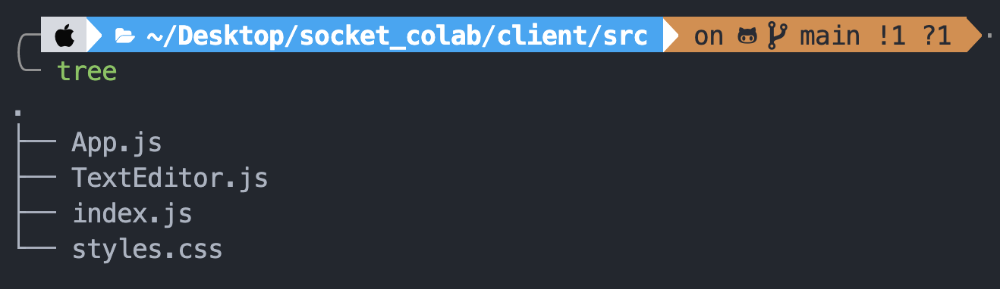
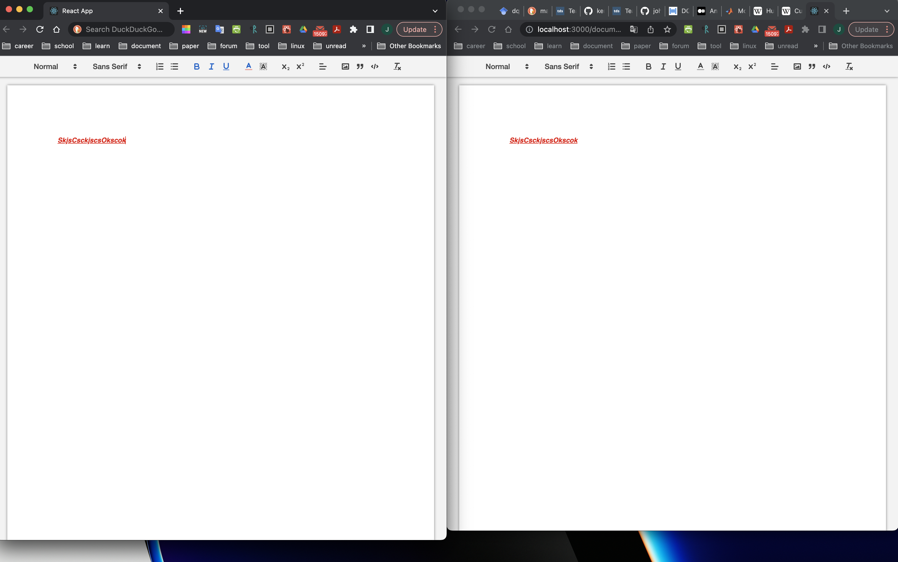

# Scoket Colab

## Usage

1. Clone this repo
2. Install required packge with in both server and client folder using `yarn install` or `npm install`
3. After these, run `yarn start` or `npm start` in server dir then client dir, you will able to see a document edit workspace.

## Folders Structure

tree

## Demo

Demo

<!--  -->

